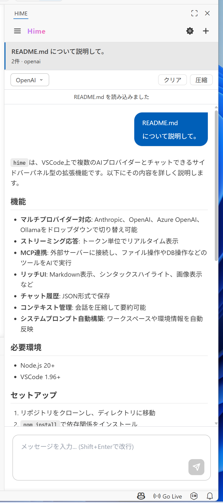

# Hime (HikariMessage)

VSCode上で複数のAIプロバイダーと対話できる、サイドバーパネル型のAIチャット拡張機能。
単なるチャットにとどまらず、ワークスペースの文脈を理解し、MCP (Model Context Protocol) を通じて外部ツールを操作することが可能です。



## 主な機能

- **マルチプロバイダー対応** — Anthropic (Claude)・OpenAI・Azure OpenAI・Ollama・OpenRouter・Google Gemini をシームレスに切り替え。
- **高度な文脈理解 (Context Awareness)** — 以下の情報をシステムプロンプトに自動統合：
    - **現在開いているファイル**: アクティブエディタのパスと内容を自動認識。
    - **プロジェクトドキュメント**: `CLAUDE.md`, `AGENTS.md`, `README.md` を自動読み込み。
    - **環境情報**: OS (Windows/macOS/Linux)、シェル (PowerShell/bash)、ワークスペースパスをAIに提供。
- **MCP (Model Context Protocol) 連携** — 外部 MCP サーバーに接続し、AI がファイル操作やコマンド実行、データベースアクセスなどの「ツール」を自律的に呼び出し可能。
- **リッチなチャット体験** — 
    - Markdown 描画（GFM対応）
    - コードブロックのシンタックスハイライト
    - 画像のプレビュー表示とファイル添付
    - 会話の要約によるコンテキスト圧縮機能
- **セキュアな設計** — API キーは VSCode 標準の SecretStorage に暗号化保存。

## 必要環境

- Node.js 20+
- VSCode 1.96+

## セットアップ

```powershell
git clone <repository-url>
cd hime
npm install
```

## ビルド

```powershell
# 型チェックのみ
npm run check-types

# Extension Host + Webview の両方をウォッチモードで起動
npm run watch

# プロダクションビルド（minify付き）
npm run package
```

## コマンド

| コマンド | 説明 |
|---|---|
| `Hime: New Chat` | 新規チャットを作成 |
| `Hime: Clear Context` | 会話コンテキストをクリア |
| `Hime: Compress Context` | 会話を要約してコンテキストを圧縮 |
| `Hime: Send Selection` | エディタの選択範囲をチャットに送信 |

## プロバイダー設定

サイドバーの **⚙** ボタンから設定パネルを開き、各プロバイダーの API キー・エンドポイント・モデルを設定できます。

| プロバイダー | API キー | デフォルトエンドポイント |
|---|---|---|
| Anthropic | 必要 | `https://api.anthropic.com` |
| OpenAI | 必要 | `https://api.openai.com` |
| Azure OpenAI | 必要 | ユーザー指定 |
| Ollama | 不要 | `http://localhost:11434` |
| OpenRouter | 必要 | `https://openrouter.ai/api` |
| Google Gemini | 下記参照 | — |

### Google Gemini の認証

2つの認証モードをサポートしています。

- **Gemini Developer API**: [Google AI Studio](https://aistudio.google.com/) の API キーを使用。
- **Vertex AI (ADC 認証)**: API キーを空欄にし、プロジェクト ID とリージョンを設定。`gcloud auth application-default login` による認証が必要です。

## MCP サーバー設定

ワークスペースルートに `mcp.json` を配置するか、拡張機能の設定パネルから設定を行うと、拡張機能起動時に自動接続します。

### Stdio (標準入出力) 接続例

```json
{
  "mcpServers": {
    "filesystem": {
      "command": "npx",
      "args": ["-y", "@modelcontextprotocol/server-filesystem", "/path/to/workspace"]
    }
  }
}
```

### SSE (HTTP) 接続例

URL を指定することで、外部の MCP サーバー（例: draw.io）に接続できます。

```json
{
  "mcpServers": {
    "drawio": {
      "url": "https://mcp.draw.io/mcp"
    }
  }
}
```

## ディレクトリ構成

- `src/extension.ts`: エントリーポイント (HimeChatViewProvider)
- `src/providers/`: AI プロバイダーの実装クラス
- `src/mcp/`: MCP クライアントとツール実行エンジン
- `src/context/`: システムプロンプト構築とワークスペース情報の収集
- `src/webview/`: React (TypeScript) + Tailwind CSS による UI
- `src/storage/`: チャット履歴と設定の永続化

## データ保存先

- `~/.hime/settings.json`: プロバイダー設定（APIキー以外）
- `~/.hime/chats/`: 各チャットの会話履歴（JSON形式）
